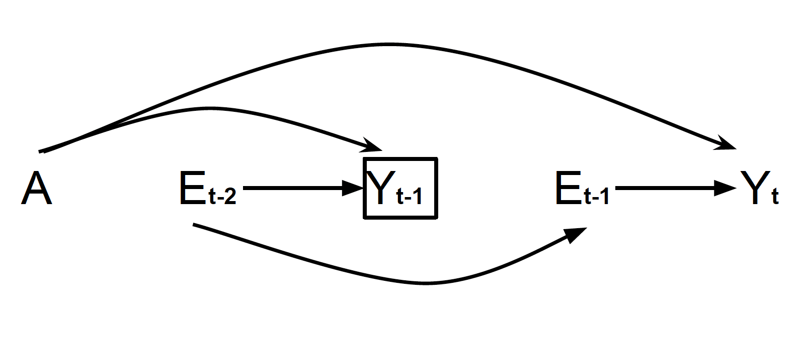

# Ando, H., O’Malley, A. J., & Nishi, A. (2026). Temporal dependence in exposure and hazard-based infectious disease interventions.

---

This repository contains the simulation framework and visualization tools used to assess the impact of temporally correlated exposure on HR. Resources provided here allow for full replication of the main results, including the generation of all figures.

---

## 📜 Scripts 

### `simulation.R`  
Simulates the vaccine trial data under the infectious window model.  

**Used in:**  

- **Figures 5**, **6**, and **7**

---

### `graph.R`  
Generates visualizations from simulated data.  

**Used in:**  

- **Figures 4**, **5**, **6**, and **7**

---

## 📦 Requirements

- R (≥ 4.0.0)  
- `tidyverse`  
- `latex2exp`

---

## 📄 Citation

If you use this code or data, please cite the original paper:

**Ando, H., O’Malley, A. J., & Nishi, A. (2026). Temporal dependence in exposure and hazard-based infectious disease interventions.**

---

## 📬 Contact

For questions or collaborations, please contact:

**Hiroyasu Ando**  
📧 hiro1999@g.ucla.edu

---
